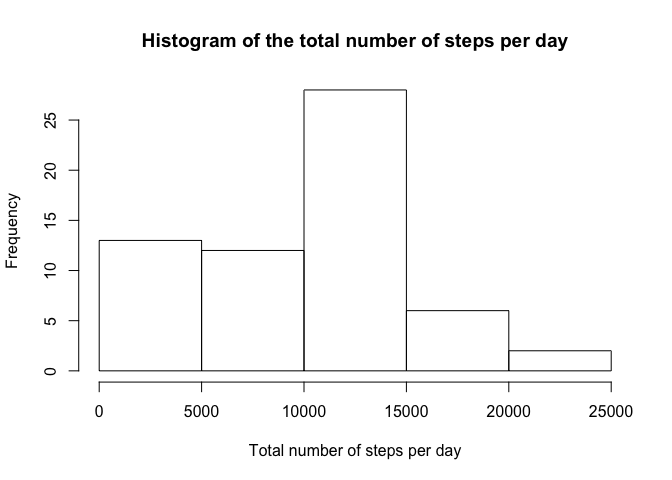
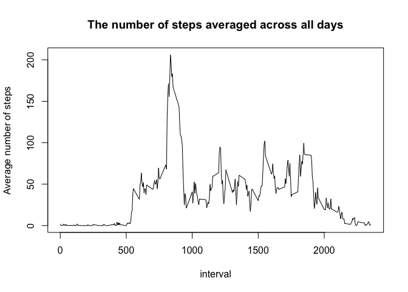
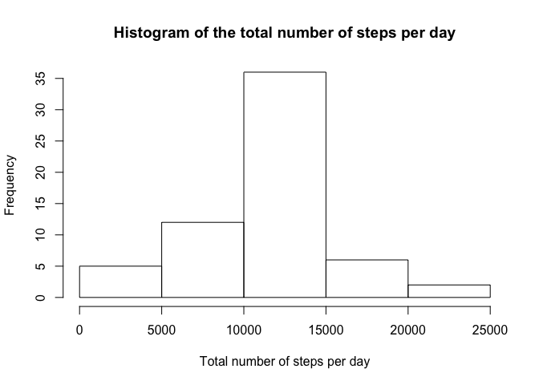
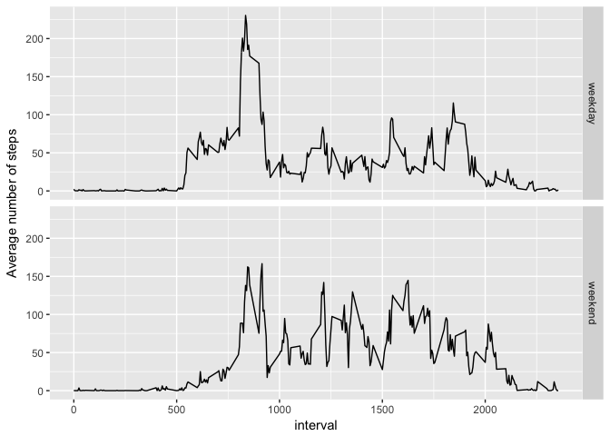

# Reproducible Research: Peer Assessment 1


```r
library(knitr)
opts_chunk$set(echo = TRUE)
```

## Loading and preprocessing the data

To load the data, we need to unzip it and then use read.csv() and store it in the data frame "activity"


```r
activity <- read.csv(unzip("activity.zip"))
str(activity)
```

```
## 'data.frame':	17568 obs. of  3 variables:
##  $ steps   : int  NA NA NA NA NA NA NA NA NA NA ...
##  $ date    : Factor w/ 61 levels "2012-10-01","2012-10-02",..: 1 1 1 1 1 1 1 1 1 1 ...
##  $ interval: int  0 5 10 15 20 25 30 35 40 45 ...
```

We need to change the date column into a proper a date class.


```r
activity$date <- as.Date(activity$date, format = "%Y-%m-%d")
```


## What is mean total number of steps taken per day?

The total number of steps taken per day


```r
library(dplyr)
```

```
## 
## Attaching package: 'dplyr'
```

```
## The following objects are masked from 'package:stats':
## 
##     filter, lag
```

```
## The following objects are masked from 'package:base':
## 
##     intersect, setdiff, setequal, union
```

```r
steps_per_day <- summarise(group_by(activity, date), sum(steps, na.rm = TRUE))
names(steps_per_day) <- c("date","total.steps")
```

A histogram of the total number of steps taken each day


```r
hist(steps_per_day$total.steps, xlab = "Total number of steps per day", main  = "Histogram of the total number of steps per day")
```

<!-- -->

The mean and median of the total number of steps taken per day


```r
summary(steps_per_day$total.steps)
```

```
##    Min. 1st Qu.  Median    Mean 3rd Qu.    Max. 
##       0    6778   10400    9354   12810   21190
```

## What is the average daily activity pattern?

A time series plot of the 5-minute interval (x-axis) and the average number of steps taken, averaged across all days (y-axis) is


```r
steps_per_interval <- summarise(group_by(activity, interval), mean(steps, na.rm = TRUE))
names(steps_per_interval) <- c("interval", "average.steps")
with(steps_per_interval, plot(interval, average.steps, type="l", ylab = "Average number of steps", main = "The number of steps averaged across all days"))
```

<!-- -->

To calculate the interval with the maximum number of steps


```r
interval <- as.numeric(steps_per_interval[which.max(steps_per_interval$average.steps),"interval"])
```

The 5-minute interval, on average across all the days in the dataset, that contains the maximum number of steps is 835

## Imputing missing values

The total number of missing values in the dataset (i.e. the total number of rows with 𝙽𝙰s)


```r
sum(is.na(activity))
```

```
## [1] 2304
```

Creating a new dataset that is equal to the original dataset but with the missing data filled in the the mean for that 5-minute interval.


```r
for(i in 1:nrow(activity)){
if(is.na(activity[i,"steps"]) == TRUE){
activity[i, "steps"] <- steps_per_interval[steps_per_interval$interval == activity[i,"interval"],"average.steps"] }}
```

The data frame with imputeed missing values looks like 


```r
head(activity,20)
```

```
##        steps       date interval
## 1  1.7169811 2012-10-01        0
## 2  0.3396226 2012-10-01        5
## 3  0.1320755 2012-10-01       10
## 4  0.1509434 2012-10-01       15
## 5  0.0754717 2012-10-01       20
## 6  2.0943396 2012-10-01       25
## 7  0.5283019 2012-10-01       30
## 8  0.8679245 2012-10-01       35
## 9  0.0000000 2012-10-01       40
## 10 1.4716981 2012-10-01       45
## 11 0.3018868 2012-10-01       50
## 12 0.1320755 2012-10-01       55
## 13 0.3207547 2012-10-01      100
## 14 0.6792453 2012-10-01      105
## 15 0.1509434 2012-10-01      110
## 16 0.3396226 2012-10-01      115
## 17 0.0000000 2012-10-01      120
## 18 1.1132075 2012-10-01      125
## 19 1.8301887 2012-10-01      130
## 20 0.1698113 2012-10-01      135
```


After imputing the missing values, we make a histogram of the total number of steps taken each day and calculate the mean and median total number of steps taken per day


```r
steps_per_day2 <- summarise(group_by(activity, date), sum(steps, na.rm = TRUE))
names(steps_per_day2) <- c("date","total.steps")
hist(steps_per_day2$total.steps, xlab = "Total number of steps per day", main  = "Histogram of the total number of steps per day")
```

<!-- -->

```r
summary(steps_per_day2$total.steps)
```

```
##    Min. 1st Qu.  Median    Mean 3rd Qu.    Max. 
##      41    9819   10770   10770   12810   21190
```

We can see that imputing missing data has changed the total daily number of steps. 

## Are there differences in activity patterns between weekdays and weekends?

Creating a new factor variable in the dataset with two levels – “weekday” and “weekend” indicating whether a given date is a weekday or weekend day.


```r
activity$day <- factor(weekdays(activity$date) == "Samedi" | weekdays(activity$date) == "Dimanche", labels=c("weekday","weekend"))
head(activity)
```

```
##       steps       date interval     day
## 1 1.7169811 2012-10-01        0 weekday
## 2 0.3396226 2012-10-01        5 weekday
## 3 0.1320755 2012-10-01       10 weekday
## 4 0.1509434 2012-10-01       15 weekday
## 5 0.0754717 2012-10-01       20 weekday
## 6 2.0943396 2012-10-01       25 weekday
```

Making a panel plot containing a time series plot of the 5-minute interval (x-axis) and the average number of steps taken, averaged across all weekday days or weekend days (y-axis). 


```r
library(ggplot2)
steps_per_interval_day <- summarise(group_by(activity, interval, day), mean(steps))
names(steps_per_interval_day) <- c('interval','day','average.steps')
ggplot(steps_per_interval_day, aes(interval, average.steps)) + geom_line() + facet_grid(day ~ .) + labs(y = "Average number of steps")
```

<!-- -->
